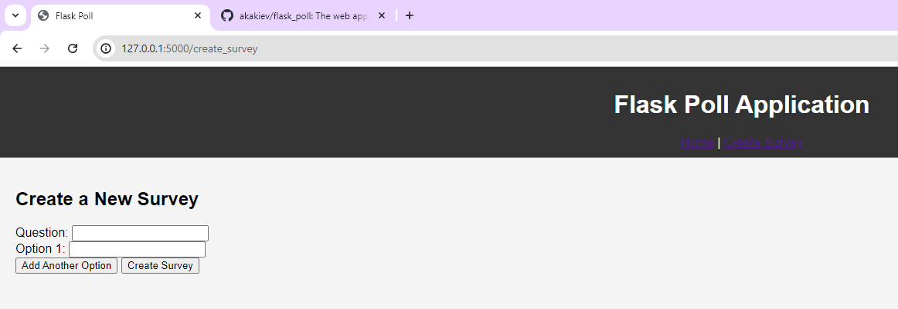

# Flask Poll Application

## Overview

The Flask Poll Application is a web application that allows users to create and participate in polls. It uses Flask for the backend, SQLAlchemy for the database, and Jinja2 for templating. The application also includes some basic animations using vanilla JavaScript.

## Features

- Create new surveys with multiple options.
- Participate in surveys and vote for options.
- View the results of surveys.
- Animated survey options and button interactions.

## Technologies Used

- **Backend**: Flask, SQLAlchemy
- **Frontend**: HTML, CSS, JavaScript, Jinja2
- **Database**: SQLite

## Project Structure

```
flask_poll/
├── app/
│   ├── __init__.py
│   ├── models.py
│   ├── routes.py
│   ├── static/
│   │   ├── css/
│   │   │   └── style.css
│   │   └── js/
│   │       └── script.js
│   └── templates/
│       ├── base.html
│       ├── create_survey.html
│       ├── index.html
│       ├── survey.html
│       └── result.html
├── config.py
├── populate_db.py
├── run.py
└── requirements.txt
```

## Installation

### Prerequisites

- Python 3.x
- `pip` (Python package installer)

### Steps

1. **Clone the repository**:
    ```sh
    git clone https://github.com/yourusername/flask_poll.git
    cd flask_poll
    ```

2. **Create a virtual environment**:
    ```sh
    python -m venv .venv
    source .venv/bin/activate  # On Windows use `.venv\Scripts\activate`
    ```

3. **Install the dependencies**:
    ```sh
    pip install -r requirements.txt
    ```

4. **Populate the database with initial data**:
    ```sh
    python populate_db.py
    ```

5. **Run the application**:
    ```sh
    python run.py
    ```

6. **Open your browser and navigate to**:
    ```
    http://127.0.0.1:5000/
    ```

## Usage

### Home Page

The home page displays a list of available surveys. You can click on any survey to participate.

### Create Survey

To create a new survey:
- Click on the "Create Survey" link in the navigation bar.
- Fill in the survey question and options.
- Click "Add Another Option" to add more options.
- Click "Create Survey" to submit the survey.

### Vote in a Survey

To vote in a survey:
- Click on a survey from the home page.
- Select an option and click "Vote".
- The results page will display the current votes for each option.

## Screenshots

### Home Page


### Create Survey Page


### Survey Page


### Result Page


## Contributing

If you would like to contribute to this project, please follow these steps:

1. Fork the repository.
2. Create a new branch (`git checkout -b feature-branch`).
3. Make your changes and commit them (`git commit -m 'Add new feature'`).
4. Push to the branch (`git push origin feature-branch`).
5. Create a new Pull Request.

## License

This project is licensed under the MIT License. See the `LICENSE` file for more details.

## Contact

If you have any questions or feedback, feel free to reach out:

- Email: serhii.baraban@put.poznan.pl
- GitHub: [akakiev](https://github.com/akakiev)